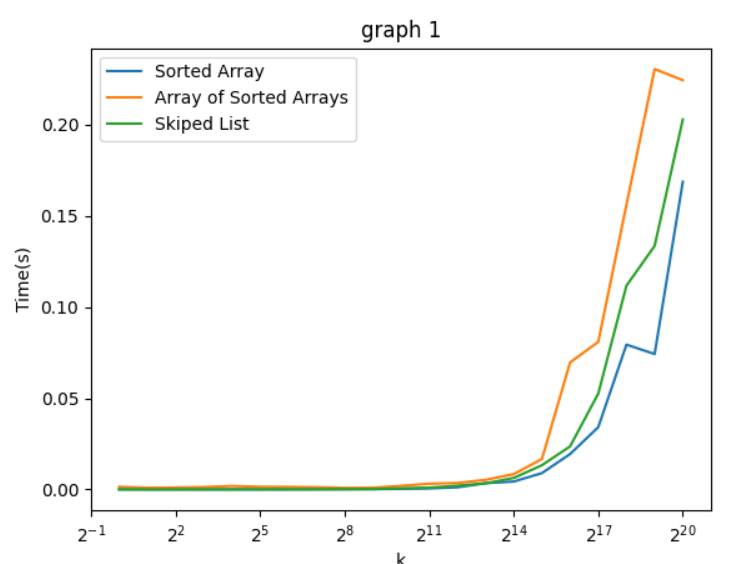

# 111703050李興旺 資料結構hw03

## **目標**

比較sorted array、array of sorted arrays、skip list的range query所需時間

## **實驗步驟：**

1. (可視電腦執行速度調整與的值)
2. 產生個數，每個數字都從隨機產生（每個數字被選到的機率都是）。
3. 將上述個數存在檔案中，每行存一個數字。
4. 讀檔並將個數存入三個資料結構中。
5. 隨機從產生（每個數字被選到的機率都是）。
6. 在三個資料結構執行range_query()，並測量時間。
7. 利用equivalent檢查range_query結果是否一致。

## 程式碼：

程式碼附在壓縮檔中及github中：

github:

[https://github.com/Thirvin/DS_HW03](https://github.com/Thirvin/DS_HW03)

會在demo時說明code。

## 實驗結果：

我們把圖分成兩個部分，$2^{11}$之前和之後：

可以發現Skip List和Sorted Array的速度差不多Array of Sorted Arrays的速度則是最慢。

因為Skip List和Sorted Array的query複雜度都是$O(logN)$所以執行時間差不多，Array of Sorted Arrays則是$O((\log N)^2)$。

Sorted Array速度最快，第二快的是Skiped List，最慢的是Array of Sorted Array。

可以看到Skip List 和 Sorted Array 速度拉開來了，原因應該是Skip List記憶體空間是離散的，所以當遍歷的數字變大變多，Cache misses會變多，所以速度會變慢。
